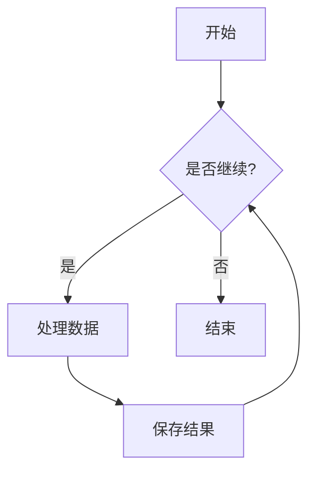
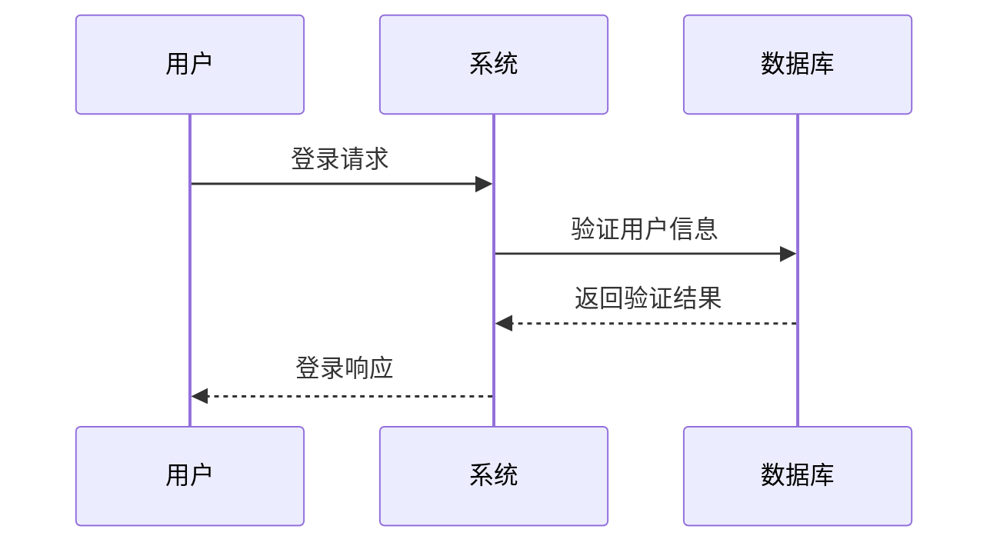
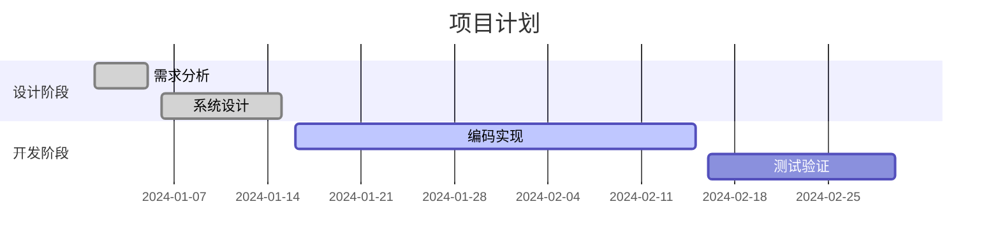
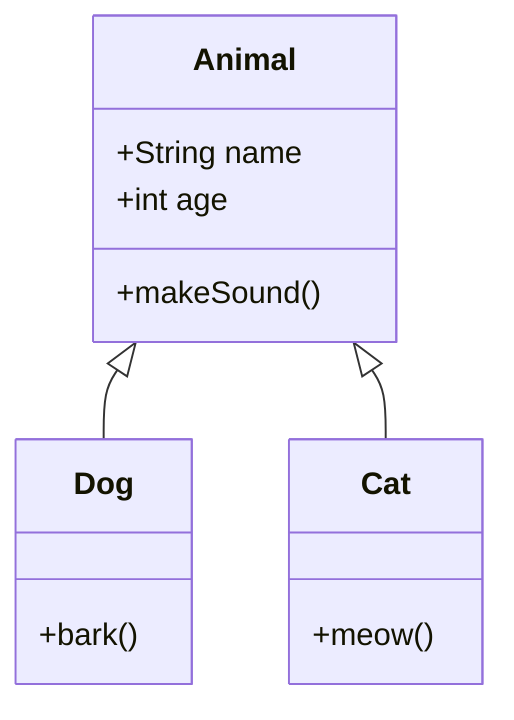
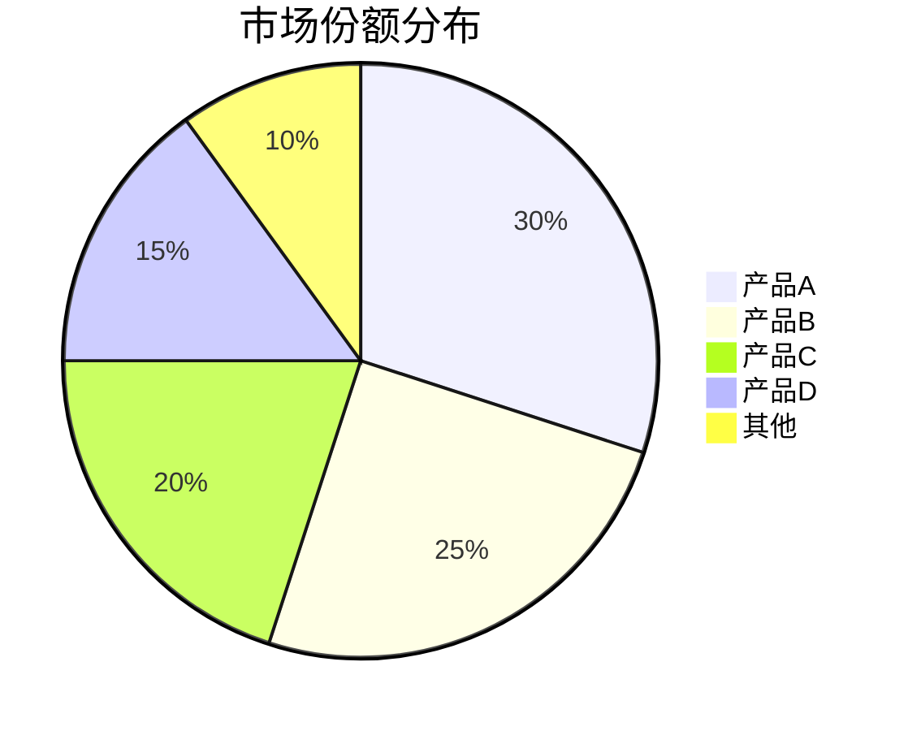
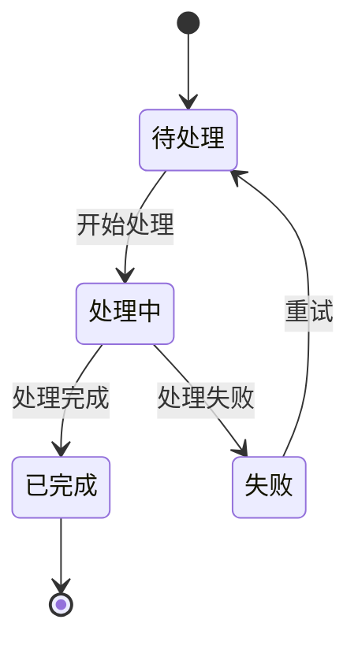

# Mermaid 图表示例

这是一个测试 Mermaid 图表渲染功能的示例文件。

## 流程图示例

```mermaid
graph TD
    A[开始] --> B{是否继续?}
    B -->|是| C[处理数据]
    B -->|否| D[结束]
    C --> E[保存结果]
    E --> B
```

## 时序图示例

```mermaid
sequenceDiagram
    participant 用户
    participant 系统
    participant 数据库

    用户->>系统: 登录请求
    系统->>数据库: 验证用户信息
    数据库-->>系统: 返回验证结果
    系统-->>用户: 登录响应
```

## 甘特图示例

```mermaid
gantt
    title 项目计划
    dateFormat  YYYY-MM-DD
    section 设计阶段
    需求分析    :done, des1, 2024-01-01, 2024-01-05
    系统设计    :done, des2, 2024-01-06, 2024-01-15
    section 开发阶段
    编码实现    :active, dev1, 2024-01-16, 2024-02-15
    测试验证    :dev2, 2024-02-16, 2024-03-01
```

## 类图示例

```mermaid
classDiagram
    class Animal {
        +String name
        +int age
        +makeSound()
    }
    class Dog {
        +bark()
    }
    class Cat {
        +meow()
    }
    Animal <|-- Dog
    Animal <|-- Cat
```

## 饼图示例

```mermaid
pie
    title 市场份额分布
    "产品A" : 30
    "产品B" : 25
    "产品C" : 20
    "产品D" : 15
    "其他" : 10
```

## 状态图示例

```mermaid
stateDiagram-v2
    [*] --> 待处理
    待处理 --> 处理中 : 开始处理
    处理中 --> 已完成 : 处理完成
    处理中 --> 失败 : 处理失败
    失败 --> 待处理 : 重试
    已完成 --> [*]
```

这些图表展示了 Mermaid 支持的各种图表类型。你可以编辑这些代码块来创建自己的图表！
